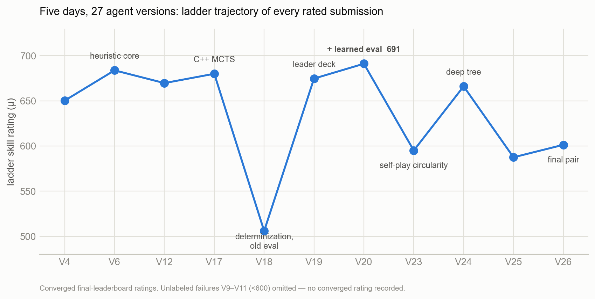
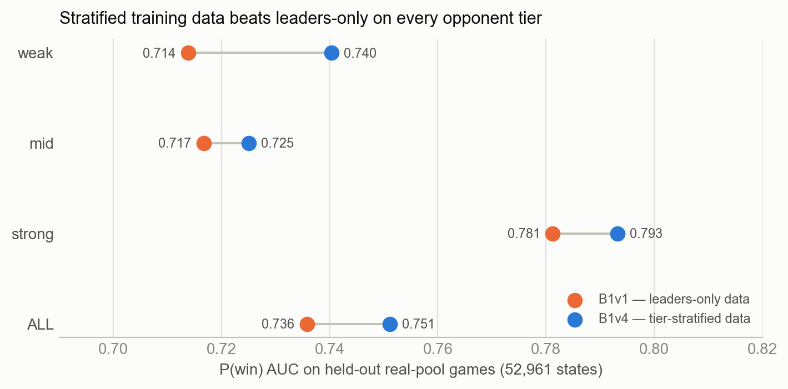

# Twenty-Seven Agents in Five Days: an Iteration-Economy Approach to PTCG AI

**Pokémon TCG AI Battle Challenge — Strategy track submission**
Team `sergueimakarov` · Simulation track peak rating **691** · Prepared 2026-09-06

*How a team that entered five days before the deadline treated every ladder
submission as a controlled experiment — and measured, with ground-truth
numbers, exactly why offline evaluation of a card-game agent cannot replace
the real pool.*

---

## 0. Summary

| | |
|---|---|
| Time in competition | 5 days (2026-08-11 → 2026-08-16); field open since June 16 |
| Agents built | 27 versions in 6 architectural families |
| Peak ladder rating | **691** (V20), vs μ₀ = 600 initialization |
| Final architecture | heuristic core + margin-gated bounded search + learned P(win) evaluator |
| Largest single verified gain | **+21** rating from the learned evaluator (V20 vs. identical agent without it) |
| Largest single verified loss | **−96** rating from training that evaluator on self-play instead of real-pool data |
| Central finding | Agent strength here is bounded by **evaluation quality**, not search depth, rollout count, hidden-information modeling, or deck choice |
| Transferable finding | Two independent local benchmarks both failed to rank our own ladder-rated agents (r = −0.00 and r = 0.25 against final ratings); the single best local scorer was the second *worst* agent on the ladder |

Every number in this report is either a live-ladder rating (ground truth) or
recomputed from raw per-game data included in the attached artifacts. Where a
result is provisional or a mechanism is inferred rather than measured, we say
so explicitly.

---

## 1. Approach: iteration economy

We entered the competition five days before the submission deadline, against
teams that had been iterating since June 16. That handicap — not a modelling
preference — dictated the whole approach:

1. **The ladder is the only instrument that measures the scored quantity.**
   Every other signal (local gauntlets, self-play, held-out AUC) is a proxy
   whose validity is an empirical question, not an assumption.
2. **Therefore submissions are scarce experiments.** At 5 submissions/day and
   ~5 days, we had roughly 25 measurements of ground truth for the entire
   project. We spent them the way an experimentalist spends beam time: one
   changed variable per submission wherever possible, with the previous
   version as its own control.
3. **Therefore the architecture must be ablatable.** Each layer (heuristic
   policy, search, learned evaluation, deck) was built so it could be
   switched off independently and shipped as a separate agent.

This is why our version line reads V1…V27 rather than a handful of big
releases: each version is a designed measurement, and several of them are
deliberately *worse* agents whose only purpose was to isolate a variable.

**Rating trajectory.** 

| Agent | What changed | Ladder μ |
|---|---|---|
| V4 | early heuristic policy | 650.2 |
| V6 | hand-tuned heuristic core (+ engine-verified bug fixes) | 683.7 |
| V12 | heuristic refinements | 669.6 |
| V17 | native C++ MCTS over the engine's search sandbox, V6 evaluation | 679.9 |
| V18 | + opponent-archetype determinization, still V6 evaluation | **506** |
| V19 | leader decklist on the V6 policy | 674.6 |
| **V20** | + learned P(win) evaluation, PUCT, determinization voting | **691** |
| V23 | V20 shell, evaluator retrained on 212K own-engine self-play games | 595 |
| V24 | true multi-level PUCT tree (~13 plies), learned leaf evaluation | 666 |
| V25 / V26 | final pair: leader deck + stratified evaluator | 587.5 / 601.3 |

Ratings are Kaggle's Bayesian skill estimate initialized at μ₀ = 600; V25 and
V26 are the converged final-leaderboard values, the rest are the settled
readings at the time each version was current. Scores
frozen on different days are not perfectly comparable — the opponent pool
drifts as thousands of teams submit — which is itself a reason we treated
*paired* comparisons (same day, same pool, one variable) as the only clean
readings.

---

## 2. Deck strategy

### 2.1 Concept

Our deck is built around **Dragapult ex** as the primary attacker. Its
*Phantom Dive* attack does two things at once: 200 damage to the Active
Pokémon and 6 damage counters distributed onto the Bench. That second clause
is the strategic core, because it breaks the fundamental symmetry of the
prize race — one knockout per turn. A deck that can convert bench damage into
a second knockout takes prizes at roughly 1.5× the rate of an opponent
trading one-for-one, which wins the race even against decks with higher raw
damage output.

The game plan is therefore tempo: reach the *Phantom Dive* loop by turn 2–3,
place bench counters so that a later attack knocks out two Pokémon at once,
and never trade evenly when an uneven trade is available.

### 2.2 The list (60 cards)

| Count | Card | Role |
|---|---|---|
| 4 | Dreepy | attacker line |
| 4 | Drakloak | attacker line |
| 3 | Dragapult ex | primary attacker |
| 2 | Budew | early item lock vs. combo openings |
| 1 | Fezandipiti ex | refuel after a knockout |
| 1 | Latias ex | free-retreat mobility |
| 1 | Meowth ex | draw support |
| 4 | Buddy-Buddy Poffin | Basic search, turn-1 board |
| 4 | Ultra Ball | universal search |
| 4 | Crispin | energy acceleration to the right type |
| 4 | Lillie's Determination | draw engine |
| 4 | Crushing Hammer | energy disruption |
| 3 | Boss's Orders | gust the target that completes the double-KO |
| 3 | Poké Pad | consistency |
| 2 | Brock's Scouting | recovery |
| 2 | Night Stretcher | recovery |
| 2 | Rare Candy | skip Stage 1, accelerate the loop |
| 2 | Team Rocket's Watchtower | stadium control |
| 1 | Lucky Helmet | draw off incoming attacks |
| 1 | Unfair Stamp | disruption after a knockout |
| 4 | Basic {P} Energy | attack cost |
| 4 | Basic {R} Energy | attack cost |

16 Pokémon / 36 Trainer / 8 Energy. Energy acceleration is deliberately
minimal: *Phantom Dive*'s cost is low, and in simulation acceleration cards
were dead draws in the large majority of games — the deck's failure mode is
not "not enough energy", it is "not enough Dragapult ex in play by turn 3",
which is why the search/draw package is this dense.

### 2.3 The ecology audit — and why we did *not* simply copy the leaders

Mid-competition we recovered the exact decklists of the top-100 teams from
organizer-published replay episodes, and diffed all 19 recovered Dragapult
lists against ours. The result was striking:

> **13 of the 19 top-100 Dragapult teams (ranks 2 through 94, ratings 1011–1217)
> run a *pairwise identical* 60-card list**, differing from ours by exactly
> the same 12 card slots.

The shared delta (leader list minus ours):

| Leaders add | Leaders cut |
|---|---|
| +2 Munkidori | −2 Rare Candy |
| +2 Basic {D} Energy | −2 Brock's Scouting |
| +2 Jamming Tower | −2 Team Rocket's Watchtower |
| +1 Judge | −1 Latias ex |
| +1 Dawn | −1 Lucky Helmet |
| +1 Poké Pad | −1 Crispin |

The "Munkidori package" (Munkidori + {D} Energy) adds damage-counter
mobility: counters placed by *Phantom Dive* can be moved onto the target that
matters, converting near-misses into knockouts. On paper it is a strict
improvement to the deck's core engine, and the convergence of 13 independent
top teams on the identical list is about as strong a prior as competitive
play ever produces.

**We built that exact list and it lost rating.** V19, V25 and V26 field the
leader list on our own agents; V19 measured 674.6 against V20's 691 on the same
policy generation, and the deeper-search versions on the leader list finished
the competition at 587.5 (V25) and 601.3 (V26) — the leader list cost us
rating at every search depth we tried it at. The mechanism is visible in the diff itself: the cards
the leaders cut (Rare Candy, Brock's Scouting, Watchtower) are consistency
and recovery; the cards they add (Judge, Jamming Tower, Munkidori) are
precision and disruption. Precision pays when both players execute nearly
perfectly, which is what happens in the 1000–1200 rating band the leaders
occupy. In the ~650–700 band where our agents actually played, games are
decided by whether *your own* engine stalls, so consistency is worth more
than precision.

**This is our first transferable strategic claim: deck strength is not
intrinsic, it is pool-relative.** Copying a leader's list without the
leader's policy quality is copying the answer to a different question. Our
final submission pair therefore fielded both lists — one on each — as an
intentional hedge rather than a bet.

---

## 3. Model architecture

Our best agent (V20, 691) is a three-layer hybrid. The ordering of the layers
is itself the design argument: each one is only worth building because the
one below it is already strong.

### Layer 1 — heuristic policy core (V1–V6, rating 683.7)

A hand-written evaluator scoring board tempo: prize-race differential,
energy-attachment efficiency, bench development, and attack reach, plus
explicit handling of the *Phantom Dive* bench-damage placement (the single
highest-leverage decision in the deck, and the source of two engine-level
bugs we found and fixed by reading the official C++ engine sources rather
than by guessing from behaviour).

We invested here first because a strong greedy baseline (a) earns rating
immediately, (b) provides a *prior* that bounds every later search layer, and
(c) is itself the control for every subsequent ablation. Notably, this ~700-line
heuristic finished within 8 rating points of our best learned agent — a data
point on the cost-effectiveness frontier that we believe many teams skipped
past on their way to heavier machinery.

### Layer 2 — bounded, margin-gated search

We built and shipped three search depths:

- **greedy** (V6) — no search;
- **one-step lookahead with a margin gate** (V20) — the shipped configuration;
- **full C++ MCTS / multi-ply PUCT tree** (V17, V24–V27), ~13 plies deep.

The search runs in a single-translation-unit C++ core compiled on first
import (the graders' container architecture is unknown from our side, so
shipping a prebuilt binary would have been a guess at ABI compatibility).
After the NumPy→C++ port it evaluates ~200K simulated turns/second, with
numerical parity to the Python reference of 1.5 × 10⁻⁷ — enough headroom to
respect the competition's hard 10-minute wall clock *per whole game* with a
large safety margin.

The counterintuitive result — quantified in §4.2 — is that **deeper search is
not monotonically better; its value is a function of how good the evaluator
is in the positions the search chooses to visit.** Our best agent therefore
uses the *shallowest* search that still exploits the learned evaluator, and
gates it: search may override the greedy choice only when the learned value
margin exceeds a threshold.

That margin gate is our primary defense on the "consistency under repeated
matches" axis. It caps the blast radius of any single evaluation error: in
the worst case the agent degrades toward V6, a known-683.7 policy, rather
than toward whatever the evaluator's most confident mistake happens to be.

### Layer 3 — learned state-value model (the "B1" line)

An XGBoost model estimating P(win) over an 87-feature state vector
(prize count, tempo, energy, bench development, hand and discard features),
trained on positions extracted from organizer-published replays of real
ladder games and labeled by the game's final outcome.

- **B1v1**: 341K positions from top-ladder games; AUC 0.833 on held-out
  top-tier games. Dropped into V20, it added **+21 rating over the identical
  agent without it** — our single largest verified improvement.
- The model is exported to static C++ arrays (115–161 trees) with bit-exact
  parity verified against the Python model, so the shipped agent has **zero
  Python dependencies** and search can call the evaluator ~10⁵ times per turn.
  (The parity check caught a real trap: NumPy's NEP-50 float32 comparison
  semantics differ from C++'s, which silently flips leaf selection on
  near-threshold features. Documented in `tools/export_b1_cpp.py`.)

**Training data mattered far more than model capacity.** Two controlled
comparisons, same agent shell, same search, only the evaluator's training set
changed:

| Evaluator | Training data | Ladder result |
|---|---|---|
| B1v1 | top-ladder (leader) games only | **691** (V20) |
| B1v2 | our own agents' self-play (212K games) | 595 (V23) — **−96** |
| B1v4 | stratified: weak + mid + strong ladder tiers | see §4.3 |

Self-play data was actively harmful, and the mechanism is circularity: the
model learns the biases of the very policy that will later be guided by it,
so it scores its own preferred lines as safe. A learned evaluator inherits
the blind spots of whoever generated its positions.

---

## 4. What we measured about measurement

This is the section we consider our most transferable contribution. All four
findings are backed by ladder ratings and by raw per-game data included in
the attachments.

### 4.1 Local benchmarks did not rank our own agents — under two independent designs

We built two different local benchmarks and, after the deadline, checked both
against the ladder ratings the same agents had actually earned.

**Benchmark A — fixed archetype gauntlet.** Each agent plays a fixed set of
meta decks piloted by generic policies (60–90 games per agent).

| Agent | Gauntlet win rate | Ladder μ |
|---|---|---|
| V17 | 0.700 | 679.9 |
| V18 | 0.711 | **506** |
| V20 | 0.900 | 691 |
| V23 | 0.783 | 595 |
| V24 | 0.850 | 666 |
| V25 | **0.950** | 587.5 |

Pearson r = 0.25, Spearman ρ = 0.03 (n = 6) — indistinguishable from noise at
this sample size. V18's collapse is by far the largest residual, so we also
report the fit without it: **r = −0.28, Spearman ρ = −0.30** (n = 5) — if
anything, the benchmark points the wrong way. It carries no usable rank
information about our own agents either way.

The single row that matters most needs no statistics at all: **V25 scored the
highest local win rate we ever recorded (57 of 60) and finished second-worst
of the six on the ladder.**

**Benchmark B — anchored round-robin against our own rated agents.** After the
deadline we ran 192 games of a new agent (V27) against eight of our own
agents whose true ladder ratings were known, spanning 587.5–691. If local play
carried rating information, V27's win rate should track the anchor's rating.

| Anchor | Its ladder μ | V27's win rate vs. it |
|---|---|---|
| V20 | 691.0 | 0.625 |
| V6 | 683.7 | 0.438 |
| V17 | 679.9 | 0.250 |
| V19 | 674.6 | 0.500 |
| V24 | 666.0 | 0.562 |
| V26 | 601.3 | 0.562 |
| V23 | 595.0 | 0.375 |
| V25 | 587.5 | 0.500 |

Pearson r = **−0.004** — zero to three decimal places (Spearman ρ = 0.07).
V27 beat our 691-rated champion 10:6 and *lost* to our 595-rated straggler
6:10.

**Why.** A family round-robin measures rock-paper-scissors dynamics among
agents that share a deck, an evaluation function, and therefore a set of
blind spots. A fixed archetype gauntlet measures performance against *our own
assumptions* about what the meta plays and how it plays it. The ladder ranks
agents against ~1,800 active submissions built by thousands of independent
teams. Neither proxy contains that diversity, and no amount of extra local
games adds it — the games are correlated, so the confidence interval shrinks
while the bias stays exactly where it was.

We paid for this lesson in submissions before we proved it in numbers: three
of our ladder submissions were justified by local scores that turned out to
be mirages.

### 4.2 Search amplifies the tails of evaluation error

Two paired ladder comparisons, each isolating "add depth, change nothing
else":

| Comparison | Change | Ladder effect |
|---|---|---|
| V24 vs V23 | + deep PUCT tree, evaluator matched to the pool | **+71** |
| V25 vs V19 | + deep PUCT tree, evaluator facing an off-distribution pool | **−87.1** |

Same architectural change, opposite sign. Depth is not a property with a
fixed sign. Search maximizes over the evaluator's
output, so it systematically finds and steers toward the positions where the
evaluator is most wrong — the optimizer's curse. When the evaluator's errors
are small and unbiased in the region search explores, depth converts into
rating (+71). When they are not, depth converts into a confident march into
the blind spot (−87), and the deeper the search, the more reliably it finds
that blind spot.

A third, larger swing points the same way, though we hold it separately
because its full attribution is less certain than the paired rows above: V18
(deep search, hand-tuned V6 evaluation) rated 506, and swapping in the learned
evaluator with the search stack otherwise unchanged produced V20 at 691.

Critically, **mean AUC differences of 1–3 points concealed this entirely.**
An evaluator that will sit underneath a deep search must be judged on its
worst-case positions, not its average discrimination. We know of no offline
metric in our toolkit that would have predicted the sign of either row above.
Our margin-gated shallow search is the architectural consequence of not
having one.

### 4.3 The evaluator's training ecology is a silent 10-point AUC tax



We rebuilt the evaluator on data stratified across ladder strength tiers
(B1v4: 215,622 training positions from 1,632 episodes) and evaluated both
models on the same neutral 52,961-position validation set:

| Validation tier | B1v4 (stratified) AUC | B1v1 (leaders-only) AUC |
|---|---|---|
| weak (15,425) | **0.740** | 0.714 |
| mid (21,063) | **0.725** | 0.717 |
| strong (16,473) | **0.793** | 0.781 |
| **all (52,961)** | **0.751** | 0.736 |

Stratified data wins on *every* tier, including the strong tier that the
leaders-only model was trained for. And the pair of numbers we consider the
most instructive in this report: **B1v1 scores 0.833 on its home distribution
and 0.736 on the neutral pool.** That ~10-point gap is pure evaluation
ecology — the model did not get worse, the yardstick did.

This is the concrete, measured form of the "over-reliance on specific
matchups" failure mode: an evaluator trained on one opponent ecology
underperforms outside it *without any local signal that it is doing so*. Only
building the stratified validation set exposed the gap.

### 4.4 Iteration count on the real environment was the binding constraint

Our rating gained roughly +20–30 per genuine ladder-informed iteration. Every
offline shortcut we tried in order to compress that loop — gauntlets against
sample agents, behaviour-cloned pilots, self-play validation — failed a later
ground-truth check (§6). Extrapolating our own trajectory, reaching the 750+
band needed 3–5 more turns of the search → data → evaluator loop, which is
roughly two more weeks of wall clock. Teams that started on June 16 had ~60
daily cycles available; we used 5.

The honest conclusion is that our gap to the leaders was **iterations, not
ideas** — and that is precisely why the measurement question above is the one
worth writing about. A team with 5 days and a valid offline proxy would beat
a team with 60 days and none.

---

## 5. Robustness and matchup breadth

The ladder is a diverse pool, so an agent's *variance* across opponent
archetypes matters as much as its mean. We logged every episode our final
pair played and broke the results down by the opponent's archetype
(identified from the replay):

| Opponent archetype | Our record | |
|---|---|---|
| Abomasnow | 5–1 | strong |
| Alakazam / Fezandipiti | 6–6 | even |
| Grimmsnarl | 3–5 | negative |
| Lucario | 2–8 | **weakest matchup** |
| Dragapult (mirror) | 2–1 | even |
| Kangaskhan | 2–0 | small sample |
| Ogerpon | 1–0 | small sample |
| Mewtwo | 0–1 | small sample |
| Other / unclassified | 9–5 | positive |
| **Total** | **30–27 (57 episodes)** | |

Turn order: 21–18 going first, 9–9 going second (we always take the first
turn when offered; the choice was validated by a dedicated experiment).

Two things are worth stating plainly. First, the agent is genuinely broad —
it holds a positive or even record against six of nine archetypes with no
matchup-specific code whatsoever. Second, **Mega Lucario ex is a real,
unfixed hole (2–8)**, and we prefer to report it than to average it away: it
is a fast single-prize aggressor that wins the race before the *Phantom Dive*
loop comes online, and the answer is a deck change (a disruption tech we cut
for consistency), not a search parameter. We ran out of ladder cycles to test
the fix; per §4.1 we do not believe the local benchmark would have told us
whether it works.

---

## 6. Negative results, kept

We report these because the mechanisms transfer, and because a report that
only lists wins is not a measurement:

- **Behavioural cloning of top players.** A policy imitating top-ladder
  players at 46% top-1 accuracy lost 0–6 even to our own baseline. Imitation
  accuracy is a per-decision metric; games are sequential, so small
  per-decision error compounds into states the demonstrator never visited and
  the clone has never seen.
- **Minimax widening.** Broadening the search's action set amplified
  evaluation error rather than averaging it out — the same mechanism as §4.2,
  observed one layer up.
- **Two generations of local pilots.** Both our generic-policy pilots and our
  imitation pilots ranked the ladder-*worst* agent first. A local benchmark
  measures strength against your own model of the game.
- **Opponent-archetype determinization with an unmatched evaluator (V18).**
  Better hidden-information modeling and +6 in the local gauntlet produced a
  ladder collapse to 506 — the largest single-version drop of the project.
  Our reading is that improving the *input* to a miscalibrated evaluator makes
  the search more decisive about the wrong thing; swapping in the learned
  evaluator with everything else held fixed recovered it to 691. We flag that
  a 130-point drop is also within reach of a plain engineering failure, and we
  did not retain per-episode logs for that submission, so we present the
  rating as measured and the mechanism as our best explanation rather than a
  demonstrated one.

---

## 7. Limitations

- **Early ladder readings are unreliable, and we treat them as such.** Our
  final pair read 610 / 613 on deadline day and converged two weeks later to
  587.5 / 601.3 — a 12–23 point downward drift, on top of an earlier case
  where a 702.5 reading settled to 679.9. Every number in this report is a
  converged or settled reading, never a fresh one; any single-day rating in
  this environment should be treated as ±25 at best.
- **Ratings taken on different days are not perfectly comparable** — the
  opponent pool drifts. We rely on same-day paired comparisons for every
  causal claim and label everything else as trajectory context.
- **n is small where we say it is small.** The correlation results in §4.1
  are n = 6 and n = 8 agents; they support "this proxy is unusable for
  ranking", not a precise effect size. The 57-episode matchup table in §5 has
  wide intervals per archetype.
- **Our conclusions are calibrated to the 600–700 band.** We never played in
  the 1000+ band the leaders occupy, and §2.3 is precisely an argument that
  conclusions do not transfer across bands for free — including, in
  fairness, our own.

---

## 8. Conclusions

1. **A tuned heuristic with bounded search reaches ~98% of a learned system's
   rating at a small fraction of the engineering cost.** The learned
   evaluator earned its +21 only because it sat on top of that anchor.
2. **Deck strength is pool-relative.** Thirteen top-100 teams converged on one
   list; that list made *our* agents worse, in a measurable and explicable
   way. Validate a borrowed list at your own rating band before adopting it.
3. **Train evaluators on opponent-stratified real data, never on self-play
   alone** (−96 rating), and judge them by tail behaviour whenever a search
   sits above them — average AUC hid a swing of 135 rating points between
   two agents that differed only in search depth.
4. **Budget ladder submissions as experiments from day one.** They are the
   only instrument that measures the quantity being scored, and we can now
   put a number on how little the usual local substitutes measure it:
   r = −0.00 for a family round-robin against our own rated agents, r = 0.25
   for a fixed meta gauntlet, and the best local scorer we ever produced was
   our second-worst agent in the real pool.

---

## Appendix — artifacts and reproduction

All claims above are reproducible from the attached materials.

| Claim | Artifact |
|---|---|
| Rating trajectory (Fig. 1), per-tier AUC (Fig. 2) | `tools/make_writeup_figures.py` |
| §2.3 leader-list convergence (13/19 identical) | `results/leader_diff/deck_diff.md` — per-team exact diffs |
| §4.1 Benchmark A (gauntlets) | `results/v*_meta_gauntlet/summary.json` |
| §4.1 Benchmark B (anchored round-robin) | `results/anchored_rr/{summary.json,raw_games.jsonl}` — all 192 games |
| §4.3 stratified evaluator | `results/b1/b1v4_report.md`, tier parquets, `tools/train_b1v4.py` |
| §5 matchup breakdown | `results/final_pair_episodes.json` — all 57 episodes |
| Agent line V1–V27 | `src/agents/` (C++ search core in `dragapult_agent_v2*_cpp/cpp/`) |

```
python tools/build_submission_challenger.py --version v24   # package an agent
python tools/meta_gauntlet_v24.py                           # local gauntlet
python tools/hth_match.py --a v24 --b v23 --games 32        # head-to-head
python tools/train_b1v4.py                                  # retrain the evaluator
python tools/anchored_rr.py                                 # reproduce §4.1 Benchmark B
```

The shipped agents are dependency-free: the learned forests are embedded as
static C++ arrays with bit-exact parity checks against the Python models. The
official competition engine is competition-use-only and is therefore not
redistributed with these artifacts; the code expects your own copy from the
competition's Data page.

*Attachments: Kaggle dataset `sergueimakarov/ptcg-ai-battle-strategy-artifacts`
(full code, tier datasets, raw round-robin games, figures) and notebook
`sergueimakarov/ptcg-b1v4-per-tier-auc-reproduction` (reproduces the §4.3
table from saved models, no retraining).*
